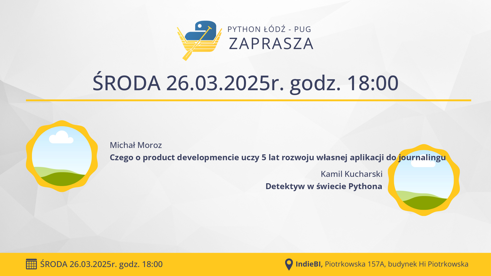

## Informacje

**📅 data:** 2025-03-26 
**🕕 godzina:** 18:00 
**📍 miejsce:** indiebi 
 ➡️ [**LINK DO ZAPISÓW**](https://www.meetup.com/python-lodz/events/305850516/) ⬅️

## Prelekcje

### Czego o product developmencie uczy 5 lat rozwoju własnej aplikacji do journalingu

Rozwijam produkt, którego sam jestem klientem i product ownerem. I na pierwszy rzut oka, to powinno dawać mi natychmiastowy feedback. W końcu nie ma narzutów komunikacyjnych, czekania aż ktoś zaakceptuje jakiś pomysł. A jednak, często idee walidują się miesiącami. Dlaczego tak jest?  
  
Modeluję dziedzinę, w której stabilny model przekłada się bezpośrednio na mój dobrostan. Precyzyjnie zdefiniowana domena – przełożona na komendy i zapytania – powinna przełożyć się na rzadko zmieniający się kod, w którym wszystko jest jasno opisane. To dlaczego niektóre funkcje okazały się zbędne po dwóch użyciach, a inne przechodziły już kilka przemian?  
  
Event Sourcing czasami wtłaczany jest młodym programistom jak mantra. Immutability is a king, sam nawet się na to złapałem i stwierdziłem “dobra, zobaczmy jak to robi w Django". W praktyce jednak nadal od czasu do czasu poprawiam rekordy w Django Adminie. A samo wprowadzenie eventów umożliwiło mi głębszą refleksje nad moim życiem, więc okazuje się, że Event Sourcing może dawać nie tylko techniczne korzyści.  
  
Obecnie mam w dzienniku 3380 wpisów. A tekże moje ulubione słowo w jednym z modeli bazy danych: „Rekontekstualizacja”. To historia przypominająca realia wielu start-upów: nie zawsze wiemy, co dokładnie tworzymy, ale działamy pomimo ograniczonego budżetu i czasu.  
  
Czego się z niej dowiesz?  
  
- Gdzie leży różnica między „manage” a „menage”.  
- Co oznacza „pivot” w świecie start-upów.  
- Jak domena może ewoluować w czasie.  
- Jak zamienić „legacy” w „opportunity”.  
- Jak prowadzić dziennik, by korzystnie wpłynął na życie.

### Detektyw w świecie Pythona

Wcielimy się w rolę detektywów, którzy z użyciem narzędzi do profilowania odkryją tajemnice tych narzędzi. Opowiem czym są takie narzędzia oraz jak działają. Dodatkowo wspólnie przejdziemy przez różne codebase-y, na których pokaże jak korzystać z tych narzędzi aby efektywnie rozwiązać problem z wydajnością i przyspieszyć działanie naszego kodu. Wszystkie osoby zainteresowane optymalizacją aplikacji i rozwiązywaniem problemów z wydajnością są mile widziane!

## Sponsorzy



