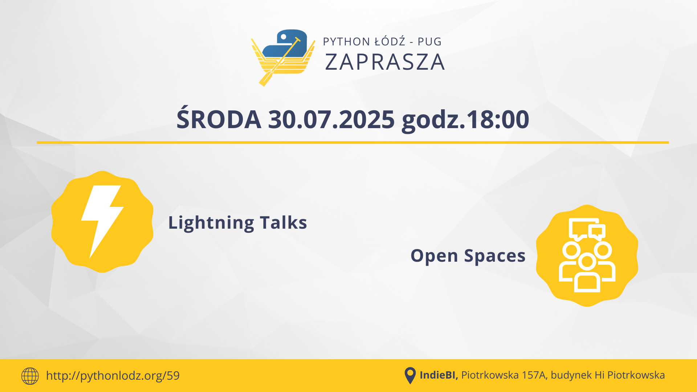

## Informacje

**📅 data:** 2025-07-30 
**🕕 godzina:** 18:00 
**📍 miejsce:** IndieBI, Piotrkowska 157A, budynek Hi Piotrkowska 
➡️ [**LINK DO ZAPISÓW na meetup**](https://www.meetup.com/python-lodz/events/309046591) ⬅️ 
➡️ [**Zgłoszenia do Lightning Talk**](https://docs.google.com/forms/d/e/1FAIpQLSd14qYEV4946e_sZOToWV9cE1bEqO0BYZF3tYlzdL2s1YIBJg/viewform?usp=dialog) ⬅️



## Lightning Talk

Chcesz spróbować swoich sił na scenie?
Zgłoś swój **Lightning Talk** już dziś przez formularz - pomoże nam to lepiej zaplanować spotkanie.
Możesz też zgłosić się w dniu meetup’u prowadzącemu - czyli **30.07.2025 o 18:00**.

Ostateczne potwierdzenie wystąpienia robimy tuż przed prezentacją.
Jeśli nie zdążysz przygotować tematu albo coś Ci wypadnie - nic się nie stało!

### 🎉 **Nagroda!**

Dla osób, które poprowadzą Lightning Talk, będą do rozdania **dwie wejściówki na tegoroczny PyConPL!**

### Czym jest Lightning Talk?

Krótka prezentacja na maksymalnie **5 minut**, w której możesz opowiedzieć o czym tylko chcesz (oczywiście najlepiej, jeśli ma to związek z Pythonem i naszą społecznością).

### Zasady

- **5 minut** na wypowiedź. Nie musisz wykorzystać pełnego czasu - możesz mówić minutę, jeśli chcesz.
- **Dowolna forma** - możesz mieć slajdy albo nie. Pokaż stronę projektu, zrób mini live demo, opowiedz historię, a jeśli chcesz - możesz nawet zatańczyć!
- **Tematyka** - Python, wszystko co z nim związane, ale też:
  - własne biblioteki,
  - ciekawe lokalne inicjatywy,
  - inspirujące fakapy z pracy,
  - projekty po godzinach.
- W ostatnich **10 sekundach** publiczność zacznie **cicho klaskać**, żeby dać Ci znać, że zbliżasz się do limitu. Po 5 minutach zaczynamy klaskać głośno - Twój czas się kończy!
- Zero spiny! Nie oceniamy, wspieramy się nawzajem i bawimy się dobrze.

### Zgłoszenia do Lightning Talka

Zgłoś swój Lightning Talk już dziś przez [**formularz**](https://docs.google.com/forms/d/e/1FAIpQLSd14qYEV4946e_sZOToWV9cE1bEqO0BYZF3tYlzdL2s1YIBJg/viewform?usp=dialog) - pomoże nam to lepiej zaplanować spotkanie.
Możesz też zgłosić się w dniu meetup’u prowadzącemu - czyli **30.07.2025 o 18:00**.

## Open Spaces

Po Lightning Talkach zapraszamy na **Open Spaces**!
To luźna i otwarta forma dyskusji, w której każdy może zaproponować temat do omówienia.
Masz coś, o czym chcesz pogadać? Widzisz problem, który warto rozkminić w grupie? Śmiało!

### Jak to działa?

- **Każdy może zgłosić temat**, który go interesuje.
- Robimy **głosowanie** na wszystkie propozycje - podnosisz rękę dowolną ilość razy, na każdy temat, który według Ciebie jest ciekawy.
- Dzielimy się na **grupy** i rozmawiamy o najpopularniejszych tematach.
- Możesz **zmieniać grupy** - jeśli jeden temat się wyczerpie, wskakujesz do innej dyskusji.
- Zero sztywnej agendy - liczy się Twoje zaangażowanie i wymiana doświadczeń.

### Dlaczego warto?

**Open Spaces** to świetna okazja, żeby:

- pogłębić tematy poruszone na Lightning Talkach,
- zadać pytania, które nie zmieściły się w prezentacji,
- poznać ludzi, którzy mają podobne wyzwania i pomysły.

Do zobaczenia na scenie!

## Sponsorzy




