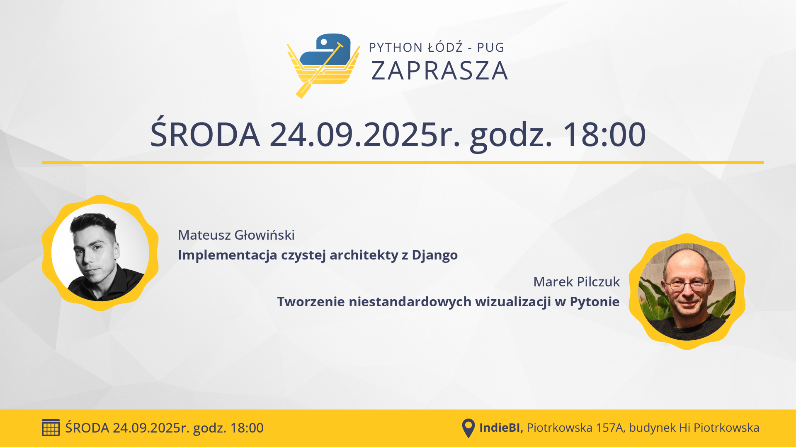

## Informacje

**📅 data:** 2025-09-24 
**🕕 godzina:** 18:00 
**📍 miejsce:** IndieBI, Piotrkowska 157A, budynek Hi Piotrkowska 
➡️ [**LINK DO ZAPISÓW**](https://www.meetup.com/python-lodz/events/310676651/) ⬅️

## Prelekcje

### Implementacja czystej architekty z Django


Prezentacja na opowiadać historię jak krok po kroku przejść z bałaganu w kodzie do czegoś co nazywamy czystą architektura wykorzystując w tym celu opcję takie jak:

- use casy
- repository pattern
- cqrs
- work of unit
- message bus

### Tworzenie niestandardowych wizualizacji w Pytonie


Choć w warstwie wizualnej JavaScript daje ogromną swobodę, w projektach, gdzie cały pipeline działa w Pythonie, to integracja bywa trudniejsza niż sama grafika. W tej sesji pokażę, jak zachować pełną kontrolę nad warstwą graficzną i jednocześnie pozostać w ekosystemie Pythona — korzystając bezpośrednio z API SVG. Zaprezentuję bibliotekę PyDreamplet: intuicyjne, a zarazem mocne narzędzie do budowy własnych wizualizacji. Na przykładach przejdziemy od „pierwszej linii kodu do gotowego pliku SVG”: układ (marginesy, siatki), skale i osie, typografia i tekst, ścieżki i geometria, komponowanie reużywalnych komponentów oraz parametryzacja stylu. Zbudujemy niestandardowy wykres jakości dostawców wyłącznie w Pythonie na API SVG. Nauczysz się generować czysty SVG, osadzać go w raportach i na stronach oraz wpiąć cały proces w pipeline danych. Finałem będzie niestandardowy wykres zbudowany od zera w PyDreamplet — maksimum kontroli nad efektem przy minimalnej ilości „kleju” technologicznego.

## Sponsorzy




