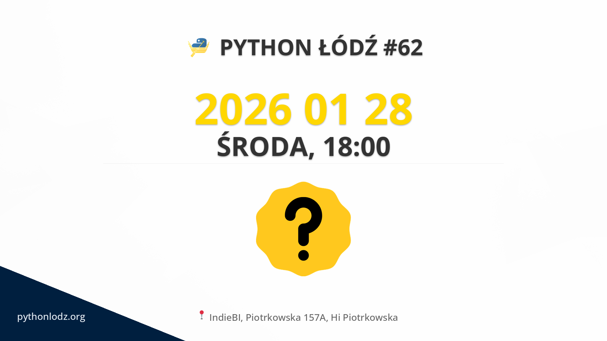

## Informacje

**📅 data:** 2026-01-28 
**🕕 godzina:** 18:00 
**📍 miejsce:** IndieBI, Piotrkowska 157A, Hi Piotrkowska 


➡️ LINK DO ZAPISÓW


## Prelekcje

Już wkrótce ogłosimy oficjalną agendę naszego najnowszego spotkania Python Łódź. Bądźcie czujni, bo szykujemy naprawdę interesujące prezentacje.

Niezależnie od tematu, każde spotkanie to świetna okazja, by poszerzyć swoją wiedzę, poznać nowych ludzi i razem budować silną społeczność miłośników Pythona.

Zarezerwuj swoje miejsce już teraz – nie daj się zaskoczyć, gdy ruszymy z pełną informacją o wydarzeniu.
## Sponsorzy



