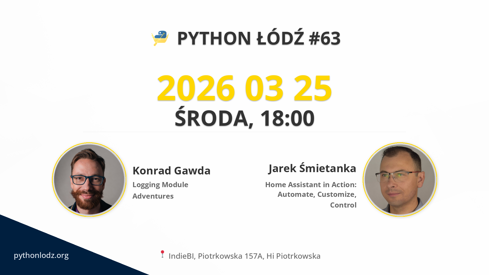

## Informacje

**📅 data:** 2026-03-25 
**🕕 godzina:** 18:00 
**📍 miejsce:** IndieBI, Piotrkowska 157A, Hi Piotrkowska 


➡️ LINK DO ZAPISÓW


## Live Stream


## Prelekcje

### Logging Module Adventures

Logging module seems a little bit odd. If you would like to understand its logic - join me on my journey into the depths of Python logging. I will share learnings from my own adventure, driven by curiosity and need to add context to long running tasks' logs.

### Home Assistant in Action: Automate, Customize, Control

Discover how Home Assistant lets you take full control of your smart home, from lights and climate to music and hydroponics. This talk covers the project’s open-source philosophy, vast ecosystem, and thriving community, alongside a real-world developer journey of setting up, securing, and customizing Home Assistant in a personal home environment. You’ll see practical examples of automation, integrations, dashboards, and remote access, plus insights on balancing flexibility, privacy, and complexity. Whether you’re a Python developer or a tech enthusiast, this session will give you inspiration and concrete ideas to start or improve your own smart home setup

## Sponsorzy

