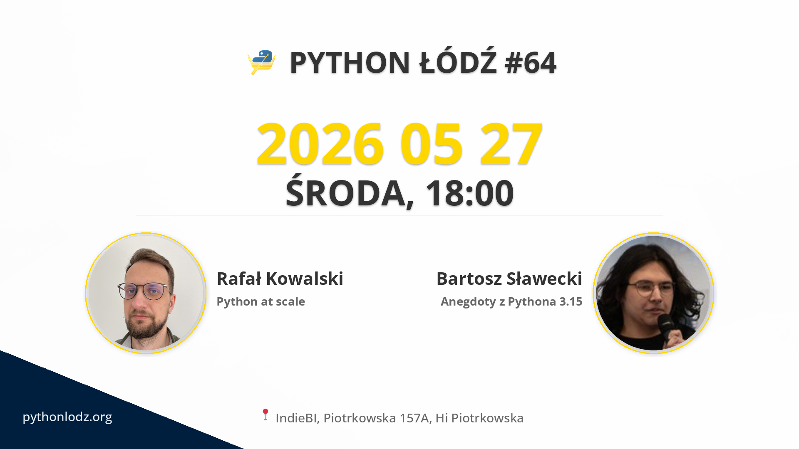

## Informacje

**📅 data:** 2026-05-27 
**🕕 godzina:** 18:00 
**📍 miejsce:** IndieBI, Piotrkowska 157A, Hi Piotrkowska 


➡️ LINK DO ZAPISÓW


## Prelekcje

### Python at scale

Czy serwis napisany w Pythonie jest w stanie działać pod dużym obciążeniem? Gdzie najczęściej pojawiają się bottlenecki? Czy Python potrafi przetwarzać wiele requestów jednocześnie? I czy async naprawdę jest koniecznością przy dużym ruchu?  
  
Wokół wydajności Pythona narosło wiele mitów. W trakcie prezentacji sprawdzimy, gdzie najczęściej leżą realne problemy oraz jak projektować i skalować usługi Pythonowe w praktyce.

### Anegdoty z Pythona 3.15

Różne ciekawostki z pracy nad najnowszą wersją języka Python (3.15) opowiedziane w przystępnym języku.  
  
Various interesting tidbits from working on the latest version of the Python language (3.15), told in plain language.

## Sponsorzy

