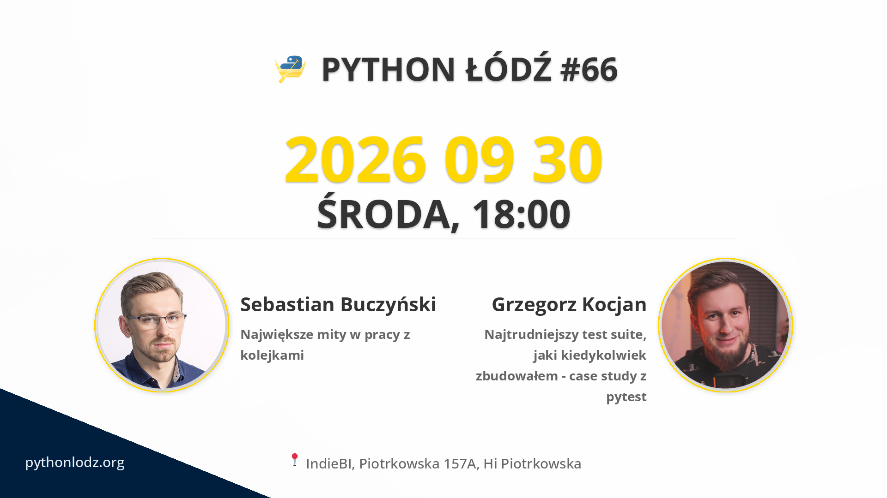

## Informacje

**📅 data:** 2026-09-30 
**🕕 godzina:** 18:00 
**📍 miejsce:** IndieBI, Piotrkowska 157A, Hi Piotrkowska 


➡️ LINK DO ZAPISÓW


## Live Stream


## Prelekcje

### Największe mity w pracy z kolejkami

Wysyłanie wiadomości na kolejkę po zatwierdzeniu transakcji jest ok. Jak wiadomość znajdzie się w kolejce, to na pewno zostanie obsłużona. Ponowienia wystarczą, żeby wiadomość została w końcu obsłużona i żaden człowiek nie będzie musiał na to patrzeć. Kafka i RabbitMQ różnią się jak dzień i noc, więc trzeba podchodzić do nich inaczej. To tylko kilka popularniejszych błędnych przekonań na temat kolejek, zadań w tle i wiadomości. Zobaczmy jak jest naprawdę, szukając kompromisu między niezawodnością i prędkością.

### Najtrudniejszy test suite, jaki kiedykolwiek zbudowałem - case study z pytest

Wyobraź sobie system do analizy wideo w czasie rzeczywistym, który przez lata rozwijano praktycznie bez testów. Każda zmiana mogła wywołać trudne do przewidzenia skutki uboczne, pogorszyć skuteczność detekcji albo skończyć się incydentem na produkcji. Weryfikacja sprowadzała się głównie do ręcznego sprawdzania wyników i nadziei, że nic się nie zepsuło.  
  
Kiedy dołączyłem do projektu, jednym z moich pierwszych celów było zbudowanie sensownej architektury testów integracyjnych.  
  
W tej prezentacji pokażę Ci, jak powstał najtrudniejszy test suite, nad którym pracowałem w swojej karierze, jak ewoluował i co zrobiłem, żeby mimo rosnącej złożoności nadal był czytelny i dało się go rozwijać.  
  
Problem był nietypowy. System analizował strumienie wideo na żywo i z natury był niedeterministyczny. Pojedyncze detekcje osiągały skuteczność na poziomie 80-90%, więc klasyczne podejście typu „wynik jest poprawny albo test nie przechodzi” po prostu się nie sprawdzało. Pojedynczy błąd nie oznaczał jeszcze, że cały system działa źle. Potrzebowaliśmy sposobu, żeby mierzyć jakość całości i wychwytywać moment, w którym zmiana faktycznie powoduje regresję.  
  
Do testów zaczęliśmy więc odtwarzać wcześniej nagrane wideo i porównywać zachowanie systemu między kolejnymi uruchomieniami.  
  
Zamiast budować jeden ogromny test, podzieliłem całość na kilka warstw:  
  
* podwójną parametryzację - na poziomie nagrania i pojedynczych zdarzeń  
* orkiestrację ukrytą we fixture'ach oraz małe testy skupione na jednej rzeczy  
* zbieranie statystyk w trakcie wykonywania testów  
* agregację wyników na końcu uruchomienia, pokazującą jakość całego systemu  
  
W efekcie powstał test suite, który nie tylko wykrywał regresje po zmianach modeli, ale też dostarczał powtarzalnych danych pokazujących, co dokładnie się zmieniło: raporty HTML, ustrukturyzowane zrzuty danych i podsumowania statystyczne.  
  
Pokażę Ci, jak daleko można wyjść z pytest poza klasyczne unit testy i wykorzystać go do zaprojektowania całej architektury testów dla złożonego, niedeterministycznego systemu.

## Sponsorzy

